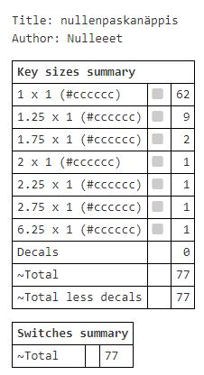

# paskanäppis
60%(ish)keyboard with ISO kc_nubs and f-row - so its really like 70% or 75%, or between, I dont know. I call it either paskanäppis or 60ish.

This is my learning opportunity to make and design my own keyboard.
Planning to use [kicad](https://www.kicad.org), [qmk](https://qmk.fm), [via](https://www.caniusevia.com) and/or [vial](https://get.vial.today) and [Keyboard PCB Builder](https://kb.xyz.is) and some 3d software (still planning what to use), and 3dprint case, for starters.
Maybe use [plate & case builder](http://builder.swillkb.com) to make acrylic case?

I tried already earlier to do this without Promicro and Elite-C, but I failed it and now the files are gone due to my hdd exploding.

So now Im going to upload everything here while im going forward with this. You can suggest and help me with everything, if you see some flaws or anything.

Layout made in [KLE](http://www.keyboard-layout-editor.com).

TO-DO list:

- Traces in kicad ✔️
- Reposition Elite-C ✔️ used promicro instead and redid traces
- make qmk/via/vial code
- Design a 3d printable case
- ('Design' a acrylic case?)
- figure out how to mounting holes and screws when at that point.✔️
